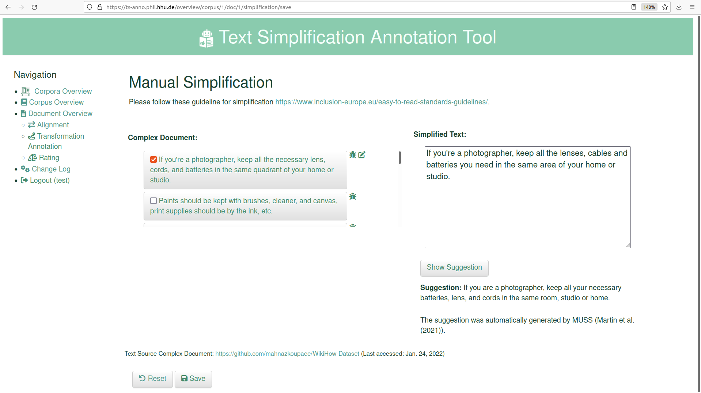

# TS-ANNO: An Annotation Tool to Build, Annotate and Evaluate Text Simplification Corpora

We introduce TS-ANNO, an open-source web application for manual creation and for evaluation of parallel corpora for text simplification (TS). 
TS-ANNO can be used for (i) sentence–wise alignment, (ii) rating alignment pairs (e.g., wrt. grammaticality, meaning preservation, ...), 
(iii) annotating alignment pairs wrt. simplification transformations (e.g., lexical substitution, sentence splitting, ...), and (iv) manual simplification of complex documents. 
For evaluation, TS-ANNO calculates inter-annotator agreement of alignments (i) and annotations (ii).

## Demo 
You can test annotation tool in our [live demo](https://ts-anno.phil.hhu.de/) (user: *test*, password: *TS_anno22*) or watch our demonstration video on YouTube.
[](https://www.youtube.com/watch?v=n6oJofcNjw8)

## Installation

- install python3
  - if you want to use the support of the automatic simplification system MUSS, we recommend to use Python < 3.8, as MUSS is dependent on fairseq, which is yet not compatible with Python 3.9
- `pip install requirements.txt`  
- set up database 
    - `python manage.py makemigrations`
    - `python manage.py migrate`
    - `python manage.py createsuperuser`
    - if you're planning to use many data, may change to postgres database than sqlite3. Read more on how to wotk with postgres an Django in [./demo/POSTGRES_DB.md](./demo/POSTGRES_DB.md)
- reset the `SECRET_KEY` in [./TS_annotation_tool/settings.py](./TS_annotation_tool/settings.py) and [./TS_annotation_tool/settings_deployment.py](./TS_annotation_tool/settings_deployment.py)
- `python manage.py runserver` open [http://127.0.0.1:8000](http://127.0.0.1:8000) in your browser
- register another user, e.g., _test_, in the interface
- if you want to deploy the tool on a server, the following tutorials  on building a Django server with uWSGI and nginx might be helpful for you
  - https://uwsgi-docs.readthedocs.io/en/latest/tutorials/Django_and_nginx.html
  - https://tonyteaches.tech/django-nginx-uwsgi-tutorial/
  - https://tonyteaches.tech/django-production-server-settings/
  - add your preferred IP-address to `ALLOWED_HOSTS` in [./TS_annotation_tool/settings_deployment.py](./TS_annotation_tool/settings_deployment.py)
  - if you use conda install uwsgi with  `conda install -c conda-forge uwsgi`
- In the [Django admin interface](http://127.0.0.1:8000/admin/), you can get an overview of all current data od your database, e.g., usernames and corpora. You can also delete entries of the database there. Please pay attention to connected models, e.g., Sentence and Tokens. You can corrupt your database by removing wrong things. In the admin interface, Django always ask you if you are sure what you're doing. 

## Main Functionalities
### Upload Data
TS-Anno supports different methods and settings of data upload. To upload some data, login with your superuser account and click on "Data Upload" in the navigation bar on the left.
You have the following choices:
- Upload and pre-process parallel online documents with TS-ANNO's web crawler, e.g., to align and annotate some web data.
- Upload local data:
  - Upload aligned texts (e.g., previously aligned or generated by a TS system). These data could be annotated or rated in TS-ANNO.
  - Upload plain but parallel texts to align, rate or annotate them.
  - Upload plain but non-parallel texts to manually simplify them.
For further instructions and settings see [.demo/Upload_Data.md](./demo/Upload_Data.md).

### Manual Sentence Alignment
One main functionality is manual sentence-wise alignment. The uploaded texts are split into sentences by SpaCy, so that several sentences of the complex and simple document can be aligned with each other. TS-ANNO supports n:m alignemnts, e.g., produced by a sentence split or merge of sentences. With the wand button most similar simple sentences of the current complex sentence can be shown. 

https://user-images.githubusercontent.com/27969267/168294595-2cfee76f-2d84-4c29-8760-c1cb2b8aa812.mp4


### Manual Rating 
TS-ANNO supports manual rating of aligned sentence pairs. In the video below the default evaluation aspects are shown, the aspects as well as the scale size can be changed at [./settings_annotation/config_rating.py](./settings_annotation/config_rating.py).

https://user-images.githubusercontent.com/27969267/168294442-e7ba703b-c688-4670-9e85-666c51ad7a0f.mp4


### Manual Annotation of Rewriting Transformations
Another functionality of TS-ANNO is the annotation of rewriting transformations performed during the simplification. One can mark the affected tokens of the rewriting in one or both of the texts and choose the level of the transformation and if identifiable also the class and sub transformation. This process can be repeated for all transformations of the pair. The name of the classes and transformations can be changed at [./settings_annotation/config_transformation.py](./settings_annotation/config_transformation.py).

https://user-images.githubusercontent.com/27969267/168294640-dcb51b12-2622-4b1c-a580-0757dc5a6660.mp4


### Simplification
Another kind of annotation supported by TS-anno is the manual simplification. The annotator can choose as many sentences as they want to simplify at once. 
The system provides the annotator with some simplification guidelines and a suggestion generated by a text simplification system. 
If you want to use the suggestion-function, set `load_simplification_model` in [./settings_annotation/config_simplification.py](./settings_annotation/config_simplification.py) to True and get your copy of a TS system, e.g., [MUSS](https://github.com/facebookresearch/muss.git).




## License:
The annotation tool is licensed under [GNU General Public License v3.0](https://github.com/rstodden/TS_annotation_tool/blob/master/LICENSE).

## Citation

If you use TS-anno in your research, please cite our paper:

```
@inproceedings{stodden-kallmeyer-2022-ts-anno,
    title = "{TS-ANNO}: An Annotation Tool to Build, Annotate and Evaluate Text
Simplification Corpora",
    author = "Stodden, Regina and Kallmeyer, Laura",
    booktitle = "Proceedings of the 60th Annual Meeting of the Association for Computational Linguistics: System Demonstrations",
    month = may,
    year = "2022",
    address = "Ireland, Dublin",
    publisher = "Association for Computational Linguistics"
}
```
## Contact:
Feel free to contact [Regina Stodden](emailto:regina.stodden@hhu.de) if you have any comments or problems with the annotation tool.
